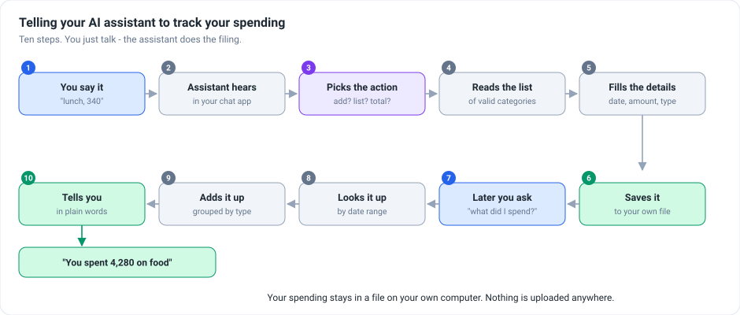

<h1 align="center">Expense Tracker for your AI assistant</h1>

<p align="center">
  <b>Just say "lunch, 340" to your AI assistant and it gets recorded.</b><br>
  Ask "what did I spend on food this month?" and it adds it up. No app, no forms,
  no spreadsheet — and your data never leaves your computer.
</p>

<p align="center">
  
  
  
</p>

---

## What is this

Expense apps fail for one reason: **logging things is tedious**, so people stop after a
week.

This removes the logging. You already talk to an AI assistant — so you tell it, the same
way you would tell a person, and it does the filing. Later you ask it questions and it
works out the answers from what you told it.

Your spending sits in a single file on your own machine. Nothing is uploaded anywhere.

---

## How it works



```
You say it                "lunch with the team, 340"
  → The assistant hears   in whatever chat app you use
  → Picks the action      record it? list it? total it up?
  → Reads the categories  so "lunch" becomes food / dining_out
  → Fills the details     date, amount, category, a note
  → Saves it              to a file on your computer
  → Later you ask         "what did I spend on food this month?"
  → Looks it up           between the dates you meant
  → Adds it up            grouped by category
  → Tells you             in plain words
→ "You spent 4,280 on food, mostly on eating out"
```

---

## What it can do

| You say | What happens |
|---|---|
| *"Coffee, 120"* | Recorded under food → coffee_tea, dated today |
| *"List everything from last week"* | Every entry between those dates |
| *"How much on transport in March?"* | A total, broken down by type |
| *"What categories are there?"* | The full list it files things under |

Categories cover food, transport, housing, health, shopping and more — each with
sub-categories, so *"fuel"* and *"parking"* both land under transport but stay separate.

---

## Setting it up

**Step 1 — download and install**

```bash
git clone https://github.com/bharatsoni0047/expense-tracker-mcp.git
cd expense-tracker-mcp
pip install fastmcp aiosqlite
```

**Step 2 — connect it to your assistant**

Add this to your assistant's configuration file:

```json
{
  "mcpServers": {
    "expenses": {
      "command": "python",
      "args": ["/full/path/to/expense-tracker-mcp/main.py"]
    }
  }
}
```

Use the full path, and restart your assistant afterwards.

**Step 3 — start talking**

> *"Add an expense: groceries, 1,250, today"*

That is the whole setup. The database file is created automatically the first time.

---

## For developers

<details>
<summary>Technical details — click to expand</summary>

**Stack:** Python 3.11 · FastMCP · aiosqlite · SQLite

Four capabilities exposed over MCP:

| Name | Kind | Purpose |
|---|---|---|
| `add_expense` | tool | Insert one entry (date, amount, category, subcategory, note) |
| `list_expenses` | tool | Entries within an inclusive date range |
| `summarize` | tool | Totals grouped by category, optionally filtered |
| `expense:///categories` | resource | The category taxonomy as JSON |

All three tools are `async` over `aiosqlite`, so a slow disk write does not block the
event loop. Initialisation stays synchronous and runs once at import, with a write test to
fail early on a read-only filesystem rather than at first use.

SQLite runs in WAL mode. The database lives in the system temporary directory by default,
which is writable everywhere but **not** durable across reboots on some systems — set an
explicit path if you want it kept permanently.

**Housekeeping applied to this repository:** `expenses.db` and a compiled cache file were
committed and are now untracked, and the previously empty `.gitignore` covers both. If you
cloned an earlier version, your own `expenses.db` was in it.

</details>

---

## Honest limitations

- **No editing or deleting.** You can add, list and total. Fixing a mistake means editing
  the file directly.
- **No currency handling.** Amounts are plain numbers, so mixing currencies will give you a
  meaningless total.
- **The default location is temporary.** On some systems the file is cleared on reboot.
  Set an explicit path for anything you want to keep.
- **No budgets or alerts.** It records and reports; it does not warn you.

---

## The story behind this project

The problem, the decisions and what came out of them: **[STAR.md](STAR.md)**.
